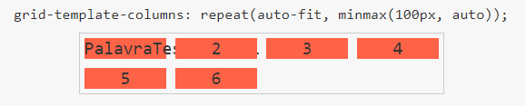

# About

Curso sobre grid layout, curso lecionado pelo Andre Rafael da Origamid.

# Fundamentos Grid

Criação de layouts complexos, exemplo de código:

[Guia grid layout](https://www.origamid.com/projetos/css-grid-layout-guia-completo/index.html)

# Grid Layout Container

## O que o grid resolve que o flexbox não consegue?

Se você observar o [FlexBlog](https://www.origamid.com/projetos/flexblog/), você pode observar ele, por exemplo, tem
3 colunas na parte de cima, o menu possui duas, depois uma... isso tudo o flexbox é capaz de resolver facilmente.

O flexbox geralmente vai agir **com colunas**, só isso! Não tem linha, se queremos outra linha abrimos outro item flex.

Agora, observando o projeto que iremos fazer, [Wildbeast](https://www.origamid.com/projetos/wildbeast/), temos um layout
totalmente diferente.

Também temos colunas, mas agora... também temos a ideia de **linhas**. Observe na imagem acima, temos a segundo coluna
que em uma linha, possui uma imagem e na outra (acima) um texto.

**E um adendo**: ali não tem nenhuma div segurando, são os elementos sozinhos numa só section. Caso fosse um projeto
flexbox, teríamos que alocar o parágrafo e a div selecionada (em vermelho e azul) em uma div.

Agora, vamos abordar as propriedades!

## Display grid

Define o elemento como um grid container.

### Inline grid

Torna o elemento um grid container porém com comportamento inline.

### Subgrid

Para grids dentro de grids (ainda não é suportado, porém, você pode normalmente colocar display: grid; no grid dentro
do grid que funciona).

## grid-template-columns

Define o número total de colunas que serão criadas no grid, veremos alguns exemplos abaixo.

### grid-template-columns: 100px 100px 100px 100px;

Quatro colunas de 100px de largura são criadas.

100px é o valor total, ignora conteúdo, margem e etc. Respeita apenas o min-width do item.

### grid-template-columns: 1fr 2fr;

Duas colunas são criadas, sendo a segunda com o dobro do tamanho da primeira. fr é uma unidade fracional.

O tamanho do conteúdo é respeitado, ou seja, se o conteúdo na primeira coluna for maior que o da segunda, a primeira será maior.

Lembrando: o "fr" respeita o conteúdo enquanto são do mesmo tamanho, observe que no caso acima a palavra do item 1 é
bem maior que os outros e mesmo a 2 coluna sendo 2fr, o grid respeitou o tamanho da primeira coluna.

### grid-template-columns: minmax(200px, 1fr) 1fr 1fr;

Três colunas são criadas, a primeira terá no mínimo 200px de largura e no máximo 1fr (isso significa que após 200px ela
se expande da mesma forma que as outras colunas). As outras duas colunas vão ter 1fr.

Ao diminuir a tela, ele primeiro vai diminuir a 2 e 3 coluna, mantendo a prioridade da primeira.

### grid-template-columns: repeat(3, 1fr);

Cria 3 colunas com 1fr de tamanho. O repeat seria a mesma coisa que escrever 1fr 1fr 1fr.

### grid-template-columns: repeat(auto-fit, minmax(100px, auto));

Cria automaticamente um total de colunas que acomode itens com no mínimo 100px de largura.

O auto vai de acordo com o conteúdo do item.

### grid-template-columns: repeat(auto-fill, minmax(100px, auto));

A diferença para o autofit, é que o autofill irá tentar preencher colunas, tendo conteúdo ou não (mesmo que ela fique
em branco/vazia).

O autofit vai preencher com o conteúdo que tem.

## grid-template-rows

Define a quantidade de linhas no grid.

Se uma linha aumenta, a outra aumenta também.

### grid-template-rows: 50px 100px 50px 150px;

Cria 4 linhas no grid, sendo a primeira com 50px, segunda 100px, terceira 50px e quarta 150px. Caso o grid necessite
de mais linhas, elas terão o tamanho de acordo com o conteúdo.

### grid-template-rows: 1fr 2fr;

