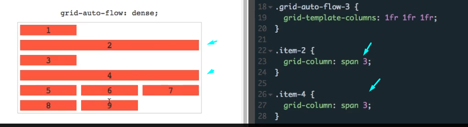
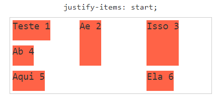
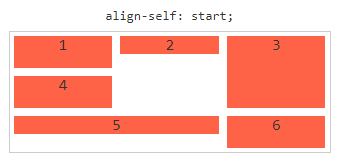

# About

Curso sobre grid layout, curso lecionado pelo Andre Rafael da Origamid.

# Fundamentos Grid

Criação de layouts complexos, exemplo de código:


[Guia grid layout](https://www.origamid.com/projetos/css-grid-layout-guia-completo/index.html)

# Grid Layout Container

## O que o grid resolve que o flexbox não consegue?

Se você observar o [FlexBlog](https://www.origamid.com/projetos/flexblog/), você pode observar ele, por exemplo, tem
3 colunas na parte de cima, o menu possui duas, depois uma... isso tudo o flexbox é capaz de resolver facilmente.

O flexbox geralmente vai agir **com colunas**, só isso! Não tem linha, se queremos outra linha abrimos outro item flex.

Agora, observando o projeto que iremos fazer, [Wildbeast](https://www.origamid.com/projetos/wildbeast/), temos um layout
totalmente diferente.


Também temos colunas, mas agora... também temos a ideia de **linhas**. Observe na imagem acima, temos a segundo coluna
que em uma linha, possui uma imagem e na outra (acima) um texto.

**E um adendo**: ali não tem nenhuma div segurando, são os elementos sozinhos numa só section. Caso fosse um projeto
flexbox, teríamos que alocar o parágrafo e a div selecionada (em vermelho e azul) em uma div.

Agora, vamos abordar as propriedades!

# Grid container

Os tópicos abaixos são relacionados ao container grid em sí. No tocante aos grid itens, iremos abordá-los depois.

## Display grid

Define o elemento como um grid container.

### Inline grid

Torna o elemento um grid container porém com comportamento inline.

### Subgrid

Para grids dentro de grids (ainda não é suportado, porém, você pode normalmente colocar display: grid; no grid dentro
do grid que funciona).

## grid-template-columns

Define o número total de colunas que serão criadas no grid, veremos alguns exemplos abaixo.

Podemos também definir os nomes das colunas:


### grid-template-columns: 100px 100px 100px 100px;

Quatro colunas de 100px de largura são criadas.

100px é o valor total, ignora conteúdo, margem e etc. Respeita apenas o min-width do item.


### grid-template-columns: 1fr 2fr;

Duas colunas são criadas, sendo a segunda com o dobro do tamanho da primeira. fr é uma unidade fracional.

O tamanho do conteúdo é respeitado, ou seja, se o conteúdo na primeira coluna for maior que o da segunda, a primeira será maior.


Lembrando: o "fr" respeita o conteúdo enquanto são do mesmo tamanho, observe que no caso acima a palavra do item 1 é
bem maior que os outros e mesmo a 2 coluna sendo 2fr, o grid respeitou o tamanho da primeira coluna.

### grid-template-columns: minmax(200px, 1fr) 1fr 1fr;

Três colunas são criadas, a primeira terá no mínimo 200px de largura e no máximo 1fr (isso significa que após 200px ela
se expande da mesma forma que as outras colunas). As outras duas colunas vão ter 1fr.


Ao diminuir a tela, ele primeiro vai diminuir a 2 e 3 coluna, mantendo a prioridade da primeira.

### grid-template-columns: repeat(3, 1fr);

Cria 3 colunas com 1fr de tamanho. O repeat seria a mesma coisa que escrever 1fr 1fr 1fr.


### grid-template-columns: repeat(auto-fit, minmax(100px, auto));

Cria automaticamente um total de colunas que acomode itens com no mínimo 100px de largura.

O auto vai de acordo com o conteúdo do item.


### grid-template-columns: repeat(auto-fill, minmax(100px, auto));

A diferença para o autofit, é que o autofill irá tentar preencher colunas, tendo conteúdo ou não (mesmo que ela fique
em branco/vazia).

O autofit vai preencher com o conteúdo que tem.


## grid-template-rows

Define a quantidade de linhas no grid.

Se uma linha aumenta, a outra aumenta também.

### grid-template-rows: 50px 100px 50px 150px;

Cria 4 linhas no grid, sendo a primeira com 50px, segunda 100px, terceira 50px e quarta 150px. Caso o grid necessite
de mais linhas, elas terão o tamanho de acordo com o conteúdo.


### grid-template-rows: 1fr 2fr;


## grid-template-areas

Define áreas específicas no grid. O ponto (.) pode ser utilizado para criar áreas vazias.

Além disso, é valido dizer: no html precisamos declarar classes para cada grid item, para que possamos nomeá-los também
no css, veja:


Um breve adendo: o nome que declaramos no grid-area, é o nome que precisamos passar no item-grid. Se dentro do grid-area
tivéssemos "a b c", deveríamos usar estes nomes nos grid itens:


```css
grid-template-areas:
"logo nav nav"
"sidenav content advert"
"sidenav footer footer";
```

Cria 3 colunas e 3 linhas, sendo:

1. [logo] ocupa a coluna 1, linha 1.
2. [nav] ocupa da coluna 2 a 3, linha 1.
3. [sidenav] ocupa a coluna 1, da linha 2 a 3.
4. [content] ocupa a coluna 2, linha 2.
5. [advert] ocupa a coluna 3, linha 2.
6. [footer] ocupa da coluna 2 a 3, linha 3


### grid-template-areas em media query (mobile)

Podemos também, reajustar todo o grid no ``@media``:


Exemplo 2:


### grid-template-areas com columns e rows

Podemos também definir o tamanho das colunas e linhas.


Entenda: cada coluna/linha que você altera, vai alterar as áreas definidas.

Se você vai na segunda coluna e declara era 200px, por exemplo, ela vai ser alterada.

### grid-template-areas com "." (área vazia)

Utilizando o ".", ele vai criar uma área vazia que não será preenchida:


## grid-template (atalho)

Um atalho para definir columns, rows e areas ao mesmo tempo, exemplo:

```css
grid-template:
"logo nav nav" 50px
"sidenav content advert" 150px
"sidenav footer footer" 100px
/ 100px 1fr 50px;
```

A primeira linha com 50px, segunda com 150px e terceira com 100px.

A primeira coluna com 100px, a segunda 1fr e a terceira com 50px.


## grid-gap

Define o gap (gutter) entre os elementos do grid.

### gap: 20px (linha e coluna)

Define 20px entre os elementos do grid (linha e coluna).


### column-gap: 20px

Define 20px de distância entre as colunas.


### row-gap: 20px

Define 20px de distância entre as linhas.


## grid-auto-columns

Define o tamanho das colunas do grid implícito (gerado automaticamente, quando algum elemento é posicionado em uma
coluna que não foi definida).

Se colocármos "auto" o tamanho será de acordo com o conteúdo do item.

### grid-auto-columns: 100px

As colunas implícitas, geradas automaticamente, terão 100px de largura.

Entenda: coluna explícita (ao contrário da acima, é quando declaramos, por exemplo, ``grid-template-columns: 1fr 1fr``).

As implícitas, são as criadas após as pré-definidas (seja por alguma alteração no código ou algo do tipo), veja:

Abaixo, temos um belo exemplo de duas colunas de 1fr 1fr:


Imagine se alocássemos o item 6, na coluna 3, uma coluna que não existe? Bom, ele vai criar a terceira coluna, veja:


Com o auto-columns, ele consegue então pré-definir o valor dessa terceira coluna (aqui usaremos 1fr):


Podemos também definir mais um de valor, por exemplo:

Aqui definimos que as duas colunas "default", terão 100px. Já as colunas que serão criadas, a primeira terá 50 e a
segunda 75px. Cabe destacar, que esse valor irá se repetir:


## grid-auto-rows

Define o tamanho das linhas do grid implícito (gerado automaticamente, quando algum elemento é posicionado em uma linha
que não foi definida).

### grid-auto-rows: 100px

As linhas implícitas, geradas automaticamente, terão 100px de altura.

É a mesma lógica do [grid-auto-columns](#grid-auto-columns).

No exemplo abaixo, definimos as duas primeiras linhas padrão com tamanho de 1fr (ambas) e as serem criadas com 100px:


### grid-auto-rows: cenário com template pronto

Veja este exemplo num cenário mais complexo:


Criamos o layout, definindo cada linha com 50, 150 e 100px respectivamente. E colunas com 100, 1fr e 50px.

As linhas que serão criadas, terão 50 e 100px, respectivamente. E o como citamos lá em cima, esse valor vai se repetindo.


## grid-auto-flow

Ao invés de ser criado uma nova linha/coluna, podemos definir o fluxo dos itens, veja:

### grid-auto-flow: row

Automaticamente gera novas linhas.

### grid-auto-flow: column

Automaticamente gera novas colunas.

O padrão do display: grid é linhas, correto?


Entretanto, se declarássemos o auto-flow com column, ele iria crias somente colunas.


Caso a gente coloque o tamanho de cada coluna para 100px, 200px, 300px e adicione mais itens no HTML, ele não irá criar
uma nova linha e **sim novas colunas, estourando o layout**:


#### Forma ideal de utilizar

A forma ideal de utilizar, é definindo linhas para que o conteúdo não estoure, veja:

Declaramos duas colunas que terão 100px mínimo se for possível 1fr (max).

Definimos também o tamanho das linhas (que serão duas).

O tamanho das colunas que eventualmente serão criadas serão 100px e passamos o ``auto-flow`` de column.


### grid-auto-flow: dense

Use em casos que não importe muito a ordem (como lista de fotos, por exemplo).

Tenta posicionar o máximo dos elementos que existirem nas primeiras partes do grid (pode desorganizar o conteúdo),
exemplo:

Definimos o grid com 3 colunas de 1fr:


E, além disso, declaramos que dois elementos irão ocupar as 3 colunas (2 e 4). Isso acaba deixando uns espaços em branco
no layout:



Se usarmos o dense, ele tentará encaixar (na ordem que der), os outros itens:


## grid (atalho geral)

Atalho geral para definir o grid: grid-template-rows, grid-template-columns, grid-template-areas, grid-auto-rows,
grid-auto-columns e grid-auto-flow

### grid: 100px / 1fr 1fr

Gera uma linha com 100px de altura e 2 colunas com 1fr.

Caso antes do "/", tivéssemos outro número, seria outra linha criada.

### grid: 100px / auto-flow 100px 50px

Gera uma linha com 100px de altura. O grid-auto-flow é definido como column (pois está logo antes da definição das
colunas). Ele também define o grid-auto-columns com 100px 50px.

Ou seja, ele declara que os eventuais itens serão adicionados em coluna (pois está do lado da coluna, após o "/"),
a primeira terá 100px a segunda 50px e o valor irá se repetir.

Se o auto-flow tivesse definido antes do "/", ele seria column.


## justify-content

Justifica os itens do grid em relação ao eixo x (horizontal) |.

### start

Justifica os itens ao início.


### end

Justifica os itens ao final.


### stretch (padrão)

Estica os itens.


### space-around

Cria um espaço no início e fim, e depois entre as colunas. Irá distribuir espaço entre os elementos, (o início e final
são menores que os espaços internos).


### space-between

Cria um espaço entre os elementos, ignorando o início e final.


### space-evenly

Cria um espaço igual entre as colunas (no início e final também).


### center

Centraliza o conteúdo.


## align-content

Alinha os itens do grid em relação ao eixo y (vertical) -.

### start

Alinha os itens ao início.


### end

Alinha os itens ao final.


### stretch

Estica os itens.


### space-around

Distribui espaço entre os elementos. (O início e final são menores que os espaços internos).


### space-between

Cria um espaço entre os elementos, ignorando o início e final.


### space-evenly

Cria um espaço igual entre as colunas (no início e final também).


### center

Centraliza o conteúdo.


## justify-items

Justifica o conteúdo dos itens do grid em relação ao eixo x (horizontal) |. Justifica em relação à célula.

O item vai continuar preenchendo a coluna toda, o sem conteúdo somente que diminuí e ele vai alinhar à coluna.

Exemplo, repare no [center](#center-2), ele possui um span: 2 para ocupar duas colunas e ele "enxuga" o conteúdo,
mas PERMANECE preenchendo duas colunas.

### start



### end


### center


### stretch (padrão)


## align-items

Alinha o conteúdo dos itens do grid em relação ao eixo y, linha/row (vertical) -. Alinha em relação à célula.

### stretch (padrão)

Por padrão, vai preencher de ponta a ponta.


### start


### end


### center


# Grid item (filhos do grid container)

Agora sim! Falaremos dos itens que estão dentro do container (declarado como grid).

Os Grid Itens são os filhos diretos do Grid Container. Um grid item pode ser explicito ou implícito. Explicito é quando
você define ele explicitamente no container e implícito é quanto ele é criado automaticamente para preencher o conteúdo
no grid.

## Grid Column

Define quais colunas serão ocupadas pelo grid item. É possível definir uma linha de início e final, assim o item irá
ocupar múltiplas colunas.

Nós precisamos declarar o item/div com uma classe para que possamos nos comunicar.

[Codepen com os exemplos](https://www.origamid.com/projetos/css-grid-layout-guia-completo/index.html)

**Se for 3 colunas, são 4 linhas.**

### grid-column: 1

O item ocupará a coluna 1.

Podemos selecionar mais de um item, consequentemente outros itens são afetados. Espaços podem ficar em branco.

### grid-column: 1 / 3

O item ocupará a coluna 1 e 2 (sim, isso mesmo, 1 e 2, pois os valores 1 / 3 são referentes as linhas da coluna.

Isso significa que começa na linha 1 (início do grid) e vai até a linha 3, que é o começo da terceira coluna).

**Cada coluna tem uma linha de início/fim, se for 3 colunas são 4 linhas.**


**Caso quiséssemos que ele ocupasse TODAS, colocaríamos "-1"**.


### grid-column-start: 2

O item vai começar na linha 2.

### grid-column-end: 4

O item vai terminar na linha 4.

### grid-column: span 2

O item irá ocupar duas colunas a partir de onde ele estiver. É bom para utilizar quando você não sabe onde o item começa,
mas quer que ele ocupe um número x de colunas/rows.

Podemos também utilizar: ``grid-column: 2 / span 2``, falando para ele começar da linha 2 e expandir duas colunas.


## Grid row

Define quais linhas serão ocupadas pelo grid item.

Atenção aqui, pois esse linha é referente a row. Porém, as chamadas grid lines que por tradução também significam linhas
do grid, são diferentes.

Uma row (linha), possui sempre 2 grid lines (linhas do grid), uma no início dela e uma no final dela (igual na coluna).

### grid-row: 1

O item ocupará a linha 1.

### grid-row: 1 / 3

O item ocupará a linha 1 e 2 (Sim, isso mesmo, 1 e 2, pois os valores 1 / 3 são referentes as linhas do grid.

Isso significa que começa na linha 1 (início do grid) e vai até a linha 3 do grid, que é o começo da terceira linha).

### grid-row-start: 2

O item vai começar na linha do grid 2.

### grid-row-end: 4

O item vai terminar na linha do grid 4.

### grid-row: span 2

O item irá ocupar duas linhas a partir de onde ele estiver.


## Grid area (atalho)

Define a área do item do grid. É um atalho para grid-row-start, grid-column-start, grid-row-end, grid-column-end.

O z-index pode ser utilizado para manipular a posição no eixo Z do item. Ou seja, se um item for posicionado em cima
de outro, o z-index controla qual vêm na frente.

### grid-area: 1 / 2 / 4 / 3;

Linha / Coluna Linha / Coluna

Atalho para column e row, é literalmente a mesma coisa que:

```css
grid-row-start: 1;
grid-column-start: 2;
grid-row-end: 4;
grid-column-end: 3;
```

Melhor usar a forma acima e usar o grid-area juntamente com o template-areas:


## Justify self (item específico)

Justifica o item específico do grid em relação ao eixo x (horizontal) |. Justifica em relação à célula.

[Codepen com exemplos](https://codepen.io/origamid/pen/yXqBJo)

### start

Justifica o item ao início.


### end

Justifica o item ao final.


### center

Justifica o item ao centro.


### stretch (padrão)

Estica o item.


## align self (item específico)

Justifica o item do grid em relação ao eixo x (horizontal) -. Justifica em relação à célula.

[Codepan com exemplos.](https://codepen.io/origamid/pen/EXpYKR)

### start

Alinha o item ao início.



### end

Alinha o item ao fim.


### center

Alinha o item ao centro.


### stretch (padrão)

Estica o item.


